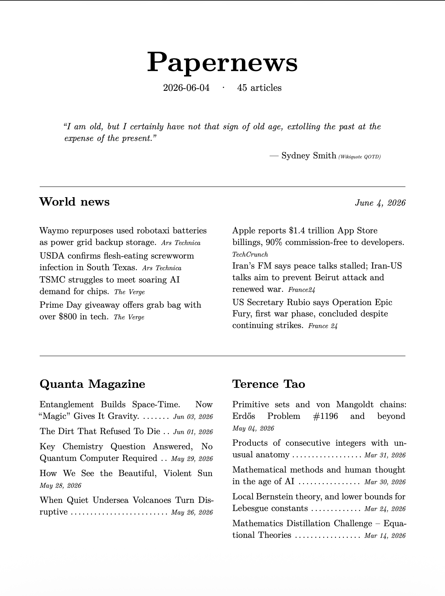
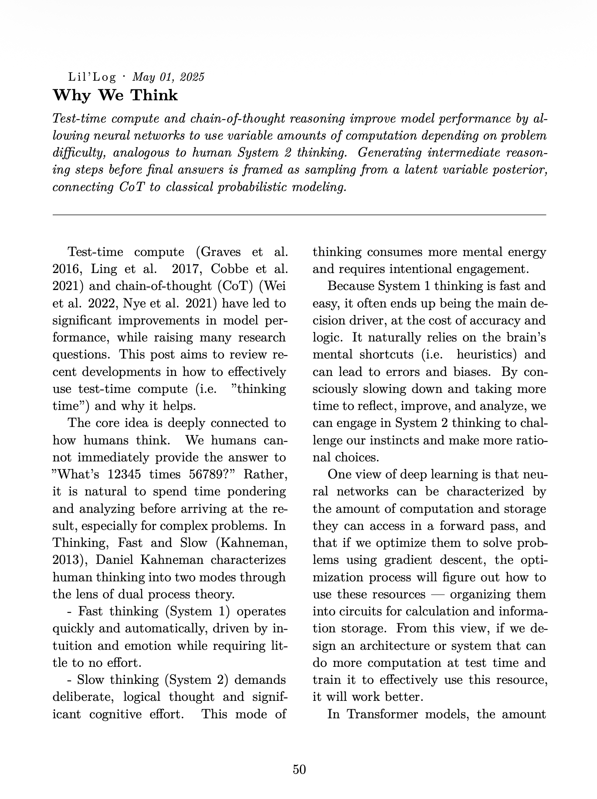

# papernews

> Fork of [marcj/papernews](https://github.com/marcj/papernews) with a Groq
> LLM backend added (`LLM_BACKEND=groq`) — free-tier inference, no local GPU
> needed. See [LLM backends](#llm-backends) below. Everything else is
> upstream; see their README for the full story.


Every news site looks different. Hacker News, MacRumors, Quanta, my
favourite ML blog, my favourite math blog — each one its own layout, fonts,
colors, ads. To read anything I had to wade through somebody's design
choices first and focus past the visual noise.

I much prefer reading the way a LaTeX paper or an old magazine looks: quiet
typography, generous margins, no color, nothing competing for attention.

**papernews** is the fix. A script pulls all those feeds, has Claude clean
up, translate to English, and rewrite the article bodies — the **full
text**, not just summaries — and renders the result into one consistently
typeset LaTeX PDF. Every article is *in* the PDF; you read entirely
offline, no clicking through, no opening tabs.

A side benefit I didn't expect to like but very much do: one place to read
the day's news instead of five tabs being refreshed all day. One or two
issues per day, no more.

Designed for an e-ink reader like the reMarkable, but it works just as well
in any browser's PDF viewer.

**👉 [See `sample-2026-06-04.pdf` for a real day's output.](sample-2026-06-04.pdf)**

## Status

Hobby project; works. Things will move. Expect rough edges.

## How to use

You need: a machine that can run Docker (your laptop, a NAS, a $5/mo VPS,
anything), an LLM backend (Anthropic API key, a free
[Groq](https://console.groq.com/keys) API key, **or** a local
[Ollama](https://ollama.com) instance), and ~2 GB of disk for the image.

```bash
# 1) Pull
git clone https://github.com/tinyw123/papernews
cd papernews

# 2) Configure
cp .env.example .env
$EDITOR .env             # paste ANTHROPIC_API_KEY=sk-ant-...
                          # (or set LLM_BACKEND=groq + GROQ_API_KEY=gsk-...,
                          # or LLM_BACKEND=ollama)

# 3) Pick your sources
$EDITOR sources.toml     # add/remove RSS/HN entries, set per-source limits

# 4) (Optional) Tweak the look
$EDITOR papernews/template.tex.j2

# 5) Build + run
docker compose up --build -d

# Open http://localhost:8000
# First PDF builds on demand and is cached. Background ingest runs every 4h.
```

Everything you'd normally want to change is in **two files**:

- **`sources.toml`** — which feeds, how many items per feed, in what order.
  Two source kinds today: `kind = "hn"` (Hacker News, top-by-points via the
  Algolia API) and `kind = "rss"` (any Atom/RSS feed via feedparser).
- **`papernews/template.tex.j2`** — the LaTeX template. Page size, fonts,
  colors, layout, what goes on the cover, everything. Edit, restart the
  container, refresh `/digest.pdf`.

Optional but useful:

- **`papernews/summarize.py`** + **`papernews/rewrite.py`** — the LLM
  system prompts. When using Anthropic, change `ANTHROPIC_MODEL` to
  `claude-sonnet-4-6` for fancier rewrites at ~10× the cost; when using
  Groq, change `GROQ_MODEL` (see [Groq](#groq-free-tier) below); adjust
  `_SYSTEM` to change the editorial voice (e.g. disable the
  auto-translate-to-English rule).
- **`papernews/wiki.py`** — what goes into the World news block and the
  Quote-of-the-day source.

### Getting the PDF onto a reMarkable

A few different ways, no special script needed:

- **Manual** — open `http://your-machine:8000/digest.pdf` in a browser on
  your phone/laptop and upload it to your reMarkable from there (drag-and-
  drop on `my.remarkable.com`, or the reMarkable mobile app, or the USB Web
  Interface at `http://10.11.99.1` while connected by USB).
- **[`rmapi`](https://github.com/ddvk/rmapi)** — a third-party CLI that
  pushes files to your reMarkable cloud account. Pair once, then:
  ```bash
  curl -s http://your-machine:8000/digest.pdf -o today.pdf
  rmapi put today.pdf /Papernews
  ```
  Stick that two-liner in cron on the host and the device picks it up on
  next sync automatically.
- **[Remailable](https://github.com/remailable/remailable)** — a third-party
  email-to-reMarkable bridge ([remailable.getneutrality.org](https://remailable.getneutrality.org)).
  You email the PDF as an attachment to your assigned address and it appears
  on the device. Useful if your papernews host can `mail`/`mutt` but can't
  reach the reMarkable directly. (reMarkable has no first-party
  email-to-device; do not believe earlier versions of this README that
  implied otherwise.)

No native push is built-in because everyone's setup is different and you
probably don't want me poking your reMarkable cloud account with your token.

## Quick start

```bash
git clone https://github.com/tinyw123/papernews
cd papernews
cp .env.example .env
# paste your ANTHROPIC_API_KEY into .env (get one at
# https://console.anthropic.com/settings/keys), or set
# LLM_BACKEND=groq + GROQ_API_KEY (free, see LLM backends below)
docker compose up --build
```

Then visit `http://localhost:8000` — landing page with a preview image and a
link to `/digest.pdf`. The first PDF builds on demand, takes ~1–2 minutes the
first time and is then cached until new content arrives.

State lives in `./data/state.db` (bind-mounted from the host) so it survives
container restarts.

## LLM backends

papernews routes all LLM calls through `papernews/llm.py`. Switch backends
with the `LLM_BACKEND` env var.

### Anthropic (default)

```bash
# .env
LLM_BACKEND=anthropic
ANTHROPIC_API_KEY=sk-ant-...
```

Uses `claude-haiku-4-5` by default. Override with `ANTHROPIC_MODEL=claude-sonnet-4-6`
for higher quality at ~10× the cost.

### Groq (free tier)

Hosted inference, OpenAI-compatible API, no GPU needed. Groq's free tier is
generous enough for a daily digest of a few dozen articles.

```bash
# .env
LLM_BACKEND=groq
GROQ_API_KEY=gsk_...                       # create at https://console.groq.com/keys
GROQ_MODEL=openai/gpt-oss-120b             # default; see below
PAPERNEWS_WORKERS=2                        # lower than the Anthropic default (8) —
                                            # the free tier's requests-per-minute
                                            # limit is easy to hit with 8 concurrent
                                            # batched calls
```

**On the model.** Groq deprecates and swaps out hosted models more often
than Anthropic — `llama-3.3-70b-versatile`, an earlier default for many
projects, was retired in August 2026. Check
[console.groq.com/docs/models](https://console.groq.com/docs/models) (or
`curl -s -H "Authorization: Bearer $GROQ_API_KEY"
https://api.groq.com/openai/v1/models`) for what's currently live before
relying on the default above. `qwen/qwen3.6-27b` is a smaller, faster
alternative that leaves more free-tier rate-limit headroom if
`openai/gpt-oss-120b` feels tight.

### Ollama (local)

Run any model locally — no API key, no per-token cost, nothing leaves your
machine.

```bash
# .env
LLM_BACKEND=ollama
OLLAMA_HOST=http://your-ollama-host:11434   # default: http://localhost:11434
OLLAMA_MODEL=qwen2.5:3b                    # default: mistral
OLLAMA_TIMEOUT=1800                        # seconds; increase for slow hardware
PAPERNEWS_WORKERS=1                        # set to 1 for CPU inference
```

**Model recommendations:** The rewrite step is token-heavy — aim for a model
that balances speed and quality for your hardware.

| Model | VRAM | Notes |
|-------|------|-------|
| `qwen2.5:3b` | ~2 GB | Fast, fits on most GPUs |
| `mistral:7b` | ~5 GB | Better quality, needs a discrete GPU |
| `qwen2.5:7b` | ~5 GB | Good quality/speed balance |

CPU inference works but is slow. A discrete GPU with ROCm (AMD) or CUDA
(NVIDIA) support makes a significant difference. Set `PAPERNEWS_WORKERS=1`
when running on CPU to avoid hammering Ollama with concurrent requests.

## What it produces

A 100–200 page PDF with:

- **Cover page**: title + date + article count, quote of the day from
  Wikiquote, a "World news" block (5 tech headlines + 2 Western items from
  Wikipedia's Current Events portal, each compressed to a single sentence).
- **Contents**: every article grouped by source, with dot-leaders to its
  publication date.
- **"Did you know…"** trivia nuggets from Wikipedia's Main Page.
- **The articles themselves**, set in two-column Latin Modern with proper
  paragraph indents, hyphenation, microtypography. Math (`$x = y$`,
  `$$\int f$$`, `\(...\)`, `\[...\]`) is rendered as real LaTeX math. Code
  blocks (fenced or inline) come through in monospace.
- All non-English source content (heise, etc.) is translated to English
  during the rewrite step. You can disable that in the prompt if you don't
  want it.

### Cover page

[📄 See the full sample PDF →](sample-2026-06-04.pdf)

[](sample-2026-06-04.pdf)

### Article body

[📄 See the full sample PDF →](sample-2026-06-04.pdf)

[](sample-2026-06-04.pdf)

## Architecture

```
                   sources.toml
                       │
            ┌──────────┴──────────┐
            │                     │
            ▼                     ▼
       ┌────────┐            ┌────────┐
       │ gather │            │ wiki/  │
       │  HN +  │            │ news + │
       │  RSS   │            │  QOTD  │
       └───┬────┘            └───┬────┘
           ▼                     │
       ┌────────┐                │
       │extract │                │
       │ (traf- │                │
       │  ilatura)               │
       └───┬────┘                │
           ▼                     │
       ┌─────────┐               │
       │summarize│ ─── LLM       │
       └───┬─────┘               │
           ▼                     │
       ┌─────────┐               │
       │ rewrite │ ─── LLM       │
       └───┬─────┘               │
           ▼                     ▼
       SQLite store (state.db)   in-memory
           │                     │
           └──────────┬──────────┘
                     ▼
              ┌──────────┐
              │  render  │ ── xelatex
              └────┬─────┘
                   ▼
             archive/cache/<hash>.pdf
```

Four stages, each idempotent and resumable:

1. **gather** — pulls new items from each source, runs `trafilatura` to
   extract the article body, stores the raw text. Pure I/O — no LLM cost.
2. **summarize** — batches up to 8 articles per LLM call and produces a
   ≤40-word two-sentence summary for each (used as the lede in the front
   matter and in the contents listing).
3. **rewrite** — batches up to 8 articles per LLM call and produces a
   clean, properly-paragraphed, translated-to-English version of each
   article body for the renderer. Preserves code fences and `$math$` exactly.
4. **render** — pulls the latest N articles per source from the store,
   plus fresh world news + quote + DYK, and runs them through a Jinja
   template into xelatex → PDF. Results are cached by a hash of "what's in
   the store" + "what's in sources.toml". Same content + same config → same
   cached PDF served instantly.

A background `APScheduler` job runs steps 1–3 every 4 hours (configurable).
The render step is on-demand; the first hit to `/digest.pdf` after an ingest
builds the PDF and caches it.

## HTTP endpoints

| route          | what it does                                            |
|----------------|---------------------------------------------------------|
| `GET /`        | minimal landing page, cover preview + Read PDF link     |
| `GET /digest.pdf` | the current edition (built on demand, then cached)   |
| `GET /preview.png` | page 1 rasterized at 180 DPI                        |
| `GET /sources` | JSON list of configured sources + latest `fetched_at`   |
| `GET /healthz` | liveness probe (returns `ok`)                           |
| `POST /ingest` | manual kick of the gather → summarize → rewrite cycle   |

## Configuring sources

Sources live in [`sources.toml`](sources.toml) — that's the exact file used
to produce [the sample PDF](sample-2026-06-04.pdf). Open it, copy a block,
edit, restart the container, refresh `/digest.pdf`.

The order of `[[source]]` blocks in the file is the order they'll appear in
the PDF — sources at the top come first. World news, quote of the day, and
the "Did you know…" nuggets are not configured here — they're cover
decorations, fetched fresh on every render.

### `kind = "hn"` — Hacker News via the Algolia search API

Ranks stories by points within a time window. No URL needed; the API is
hardcoded.

| field          | type | default | meaning |
|----------------|------|---------|---------|
| `name`         | string | required | display label (also the contents-page heading) |
| `kind`         | string | required | must be `"hn"` |
| `limit`        | int  | `10`     | how many top stories to keep |
| `since_hours`  | int  | `48`     | only consider stories submitted in the last N hours |
| `min_points`   | int  | `50`     | story must have at least this many points to qualify |

```toml
[[source]]
name        = "Hacker News"
kind        = "hn"
limit       = 10
since_hours = 48
min_points  = 100
```

### `kind = "rss"` — any Atom/RSS feed

Parsed with [feedparser](https://feedparser.readthedocs.io/), so it accepts
RSS 0.9/1.0/2.0 and Atom 1.0 — every blog and most news sites work.

| field         | type   | default  | meaning |
|---------------|--------|----------|---------|
| `name`        | string | required | display label (also the contents-page heading) |
| `kind`        | string | required | must be `"rss"` |
| `url`         | string | required | feed URL |
| `limit`       | int    | `20`     | take at most N most-recent items |
| `since_hours` | int    | unset    | skip articles published more than N hours ago (uses the feed's `published`/`updated` date; articles with no date are always kept) |

```toml
[[source]]
name        = "Quanta Magazine"
kind        = "rss"
url         = "https://www.quantamagazine.org/feed/"
limit       = 8
since_hours = 168   # one week
```

### Per-source ordering and limits in practice

The `limit` is applied **twice**, on purpose:

- At **fetch** time: gather doesn't pull more than `limit` items from the
  feed (saves bandwidth and trafilatura time).
- At **render** time: even if the store accumulates more than `limit` items
  for a source across multiple ingests (it will — items don't get deleted),
  only the latest `limit` per source make it into a given PDF.

So if you want Quanta to have at most 8 articles in the issue, regardless of
how many they've published this week → set `limit = 8`. If you want Hacker
News to show only the top 5 by points in the last 24h → set `limit = 5,
since_hours = 24`.

> **On the totals.** Adding up every `limit` in `sources.toml` gives you the
> maximum article count per issue. Aim for **30–60 articles** for a
> comfortable 30–60 minute read. Claude's summaries are dense; volume isn't
> quality. An empty section on a slow day is cleaner than padding.

## Scheduling ingests

Two modes; pick whichever fits your routine. Set the env var in `.env`.

### Every N hours (default)

```bash
# .env
INGEST_INTERVAL_SECONDS=14400   # 4 hours (the default)
```

### Cron-style fixed times — "morning and evening edition"

```bash
# .env
INGEST_SCHEDULE=07:00,18:00     # comma-separated HH:MM
INGEST_TIMEZONE=Europe/London   # any IANA tz; default UTC
```

If both are set, `INGEST_SCHEDULE` wins. The render is still on-demand —
hitting `/digest.pdf` between scheduled runs gives you the cached PDF
instantly.

You can also kick a manual ingest any time:

```bash
curl -X POST http://localhost:8000/ingest
```

## Delivery — push the PDF wherever you want

A built-in hook fires after every successful ingest. Point
`POST_INGEST_HOOK` at any executable on the container's filesystem (drop
the script into your `./data/hooks/` directory so it survives rebuilds via
the bind mount). The hook receives the freshly-built PDF path as its first
argument.

```bash
# .env
POST_INGEST_HOOK=/data/hooks/push-to-remarkable.sh
POST_INGEST_HOOK_TIMEOUT=300    # optional; default 300s
```

Hook failures are non-fatal — a broken hook logs an error but doesn't
crash the ingest loop.

### Sample: push to a reMarkable 2 over WiFi

Drop this in `./data/hooks/push-to-remarkable.sh` and `chmod +x` it:

```bash
#!/usr/bin/env bash
# Push the latest issue to a reMarkable 2 via SSH.
# Usage: push-to-remarkable.sh <pdf-path>
set -euo pipefail

PDF="$1"
REMARKABLE="root@10.11.99.1"            # adjust to your device's IP
SSH_KEY=/data/hooks/remarkable_id_ed25519

scp -i "$SSH_KEY" -o StrictHostKeyChecking=accept-new \
    "$PDF" "$REMARKABLE:/home/root/papernews.pdf"

# Refresh the UI so the file appears immediately.
ssh -i "$SSH_KEY" "$REMARKABLE" 'systemctl restart xochitl'
```

Generate a passwordless key (`ssh-keygen -t ed25519 -f
data/hooks/remarkable_id_ed25519 -N ""`), add the `.pub` to the
reMarkable's `/home/root/.ssh/authorized_keys` once, and from then on
every ingest pushes the new paper to your device.

The same pattern works for Kindle (`scp` over USB networking), a network
printer (`lp -d papernews "$PDF"`), an email (`mutt -a "$PDF"`), or
anything else you can script.

## Tests

Modest, no-network unittest suite for the web/scheduling/hook behaviour:

```bash
python -m unittest discover -s tests
```

## Local development

You don't have to use Docker — the CLI works directly:

```bash
python3 -m venv .venv
.venv/bin/pip install -e .
export ANTHROPIC_API_KEY=sk-ant-...   # or: export LLM_BACKEND=groq GROQ_API_KEY=gsk-...
                                       # or: export LLM_BACKEND=ollama OLLAMA_HOST=...

.venv/bin/python -m papernews gather       # fetch + extract
.venv/bin/python -m papernews summarize    # LLM pass 1 (batched)
.venv/bin/python -m papernews rewrite      # LLM pass 2 (batched)
.venv/bin/python -m papernews render       # xelatex → PDF
# or all of the above in sequence:
.venv/bin/python -m papernews build
```

Requirements: Python 3.11+, `xelatex` (TeX Live with `texlive-xetex`,
`texlive-latex-extra`, `lmodern`), `pdftoppm` (poppler).

## Customizing the typography

Everything visual lives in one file: [`papernews/template.tex.j2`](papernews/template.tex.j2).

- Page size: `paperwidth=157mm, paperheight=210mm` (tuned for reMarkable Pro)
- Body font: Latin Modern Roman 10pt
- Two-column body for any article over 2000 characters; single-column
  otherwise
- First-line paragraph indent instead of vertical `\parskip` (classic
  magazine convention)
- Microtype protrusion + expansion
- Letter-spacing on small-caps source labels via fontspec's `LetterSpace`

Customize whatever you like — the Jinja delimiters are LaTeX-safe
(`((* ... *))` for blocks, `((( ... )))` for variables) so your `{`, `}` and
`\` don't fight each other.

## Cost

**With Ollama:** free — all inference runs locally.

**With Groq:** free on the free tier for this workload — a daily digest of
a few dozen articles stays well within the free requests/tokens-per-day
limits. Check [console.groq.com/settings/limits](https://console.groq.com/settings/limits)
for your account's current caps.

**With Anthropic (Claude Haiku 4.5, default):** roughly per ingest cycle
with ~50 articles:

- Summarize: 6 batched calls (~8 articles each)
- Rewrite: 6 batched calls
- World-news compress: 1 call

Order-of-magnitude: a few cents to a few tens of cents per cycle depending on
article lengths. At 6 cycles/day that's well under $1/day. Going to Sonnet or
Opus multiplies the bill ~10–30×.

Set a spend cap at
https://console.anthropic.com/settings/billing → Spend limits — the run-loop
can't surprise you above whatever you set.

## Privacy

- All data lives on your machine (`./data/state.db` + `./data/archive/cache/`).
- With `LLM_BACKEND=anthropic`: article text is sent to the Anthropic API
  for summarization and rewriting. That's the only outbound destination for
  content (besides fetching the feeds themselves).
- With `LLM_BACKEND=groq`: article text is sent to the Groq API instead.
  Same shape as the Anthropic case — same only outbound destination for
  content.
- With `LLM_BACKEND=ollama`: nothing leaves your machine. All inference
  runs locally.
- No analytics, no telemetry, no third-party scripts in the landing page.

## Project layout

```
papernews/
├── papernews/
│   ├── fetch.py          # HN Algolia + RSS feedparser
│   ├── extract.py        # trafilatura
│   ├── llm.py            # LLM backend router (Anthropic, Groq, or Ollama)
│   ├── summarize.py      # summarization prompts + batching
│   ├── rewrite.py        # rewrite prompts + batching
│   ├── wiki.py           # World news / Quote / DYK / tech feeds
│   ├── store.py          # SQLite article store + queries
│   ├── render.py         # Jinja + xelatex
│   ├── preview.py        # PDF → PNG via pdftoppm
│   ├── cache.py          # On-disk cache by content hash
│   ├── cli.py            # papernews command
│   ├── web.py            # Flask + APScheduler
│   └── template.tex.j2   # the magazine
├── sources.toml          # configured feeds
├── pyproject.toml
├── Dockerfile
├── docker-compose.yml
└── data/                 # gitignored — your SQLite + cached PDFs
```

## Contributing

Open an issue first if you're planning something non-trivial — happy to talk
about direction. The codebase is small enough that you can read it end to
end in an hour.

## License

MIT — see [LICENSE](LICENSE).

## Why "papernews"

Working name; happy to take suggestions. The vibe is: an old-fashioned daily
paper, not a feed. You read it once, then you put it down.
